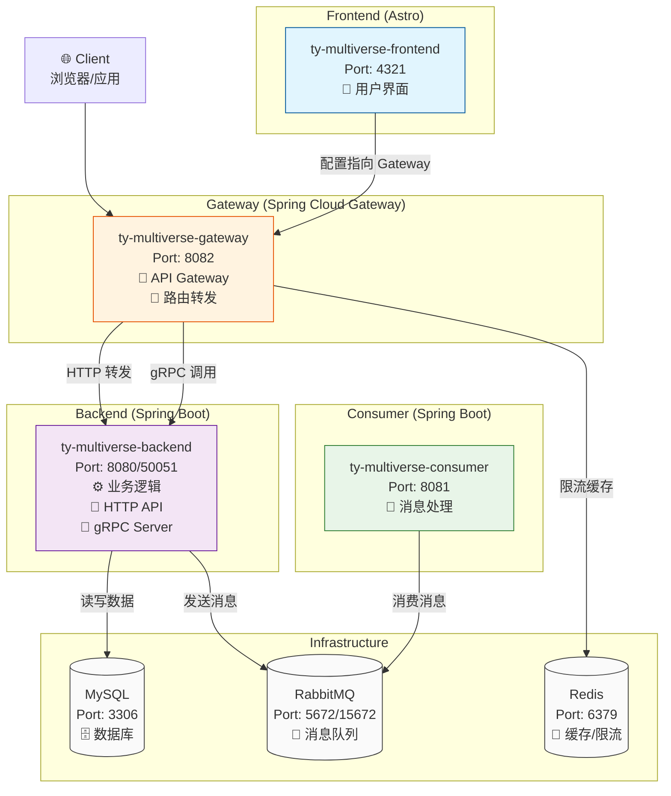

# TY Multiverse Gateway

API Gateway for TY Multiverse system using Spring Cloud Gateway.

## 概述

TY Multiverse Gateway 是整個 TY Multiverse 系統的統一入口，負責將前端的所有請求路由到後端服務。使用 Spring Cloud Gateway 提供高性能、可擴展的 API 閘道器功能。

## 主要功能

- **統一路由管理**：將所有前端請求統一路由到後端服務
- **負載均衡**：支援多個後端實例的負載均衡
- **限流保護**：基於 Redis 的分散式限流機制
- **熔斷降級**：使用 Resilience4j 提供熔斷保護
- **跨域處理**：統一處理 CORS 跨域請求
- **日誌追蹤**：記錄所有經過的請求和響應
- **監控指標**：提供 Prometheus 格式的監控指標

## 技術架構

- **Spring Boot**: 3.2.7
- **Spring Cloud Gateway**: 2023.0.2
- **Java**: 21
- **Redis**: 用於分散式限流
- **Resilience4j**: 熔斷器實現

ㄜ## 系統架構圖



### 組件說明

| 項目 | 技術棧 | 端口 | 主要功能 |
|------|--------|------|----------|
| **Frontend** | Astro + TypeScript | 4321 | 📱 用户界面，调用 Gateway |
| **Gateway** | Spring Cloud Gateway | 8082 | 🚪 API 网关，路由转发，限流熔断 |
| **Backend** | Spring Boot + gRPC | 8080/50051 | ⚙️ 业务逻辑，HTTP API + gRPC 服务 |
| **Consumer** | Spring Boot | 8081 | 📨 异步消息处理 |

### 通信協議

- **Frontend ↔ Gateway**: HTTP REST
- **Gateway ↔ Backend**: HTTP REST + gRPC
- **Backend ↔ Consumer**: RabbitMQ 消息队列
- **Backend ↔ MySQL**: JDBC
- **Gateway ↔ Redis**: Redis 协议（限流缓存）

## 路由配置

Gateway 轉發以下端點到 Backend：

| 路徑 | 目標服務 | 說明 |
|------|---------|------|
| `/tymb/people/**` | Backend | 人物管理 API |
| `/tymb/people-images/**` | Backend | 人物圖片 API |
| `/tymb/weapons/**` | Backend | 武器管理 API |
| `/tymb/gallery/**` | Backend | 圖庫管理 API |
| `/tymb/ckeditor/**` | Backend | CKEditor 文件上傳 |
| `/tymb/deckofcards/blackjack/**` | Backend | 21點遊戲 API |
| `/tymb/guardian/**` | Backend | 認證守護 API |
| `/tymb/keycloak/**` | Backend | Keycloak 整合 |
| `/tymb/api/request-status/**` | Backend | 異步請求狀態 |
| `/tymb/api/test/async/**` | Backend | 異步測試 API |
| `/tymb/docs/**` | Backend | JavaDoc 文檔 |
| `/tymb/actuator/**` | Backend | Actuator 監控 |
| `/tymb/swagger-ui/**` | Backend | Swagger UI |

## 項目結構

```
ty-multiverse-gateway/
├── src/
│   ├── main/
│   │   ├── java/
│   │   │   └── tw/com/tymgateway/
│   │   │       ├── TYMGatewayApplication.java     # 主應用類
│   │   │       ├── config/
│   │   │       │   └── GatewayConfig.java         # Gateway 配置
│   │   │       ├── controller/
│   │   │       │   └── FallbackController.java    # 熔斷降級控制器
│   │   │       └── filter/
│   │   │           └── LoggingGlobalFilter.java   # 全局日誌過濾器
│   │   └── resources/
│   │       ├── application.yml                     # 主配置文件
│   │       ├── application-local.yml              # 本地環境配置
│   │       └── env/
│   │           ├── local.properties               # 本地環境變數
│   │           └── platform.properties            # 平台環境變數
│   └── test/                                      # 測試代碼
├── k8s/
│   └── deployment.yaml                            # K8s 部署配置
├── Dockerfile                                      # Docker 鏡像構建
├── Jenkinsfile                                     # CI/CD 流程
├── pom.xml                                         # Maven 配置
└── README.md                                       # 本文檔
```

## 本地開發

### 前置要求

- Java 21
- Maven 3.9+
- Redis (可選，用於限流功能)

### 啟動步驟

1. **啟動 Backend 服務**
   ```bash
   cd ../ty-multiverse-backend
   mvn spring-boot:run
   ```

2. **啟動 Gateway**
   ```bash
   mvn spring-boot:run
   ```

   Gateway 將在 `http://localhost:8081` 啟動

3. **訪問測試**
   ```bash
   # 測試健康檢查
   curl http://localhost:8081/actuator/health
   
   # 測試路由轉發（需要 Backend 運行）
   curl http://localhost:8081/tymb/weapons
   ```

### 配置說明

本地開發時，在 `src/main/resources/env/local.properties` 中配置：

```properties
# Backend 服務地址
BACKEND_SERVICE_URL=http://localhost:8080

# 前端地址（CORS）
PUBLIC_FRONTEND_URL=http://localhost:4321

# Redis 配置（可選）
REDIS_HOST=localhost
REDIS_CUSTOM_PORT=6379
REDIS_PASSWORD=
```

## Docker 部署

### 構建鏡像

```bash
docker build -t ty-multiverse-gateway:latest .
```

### 運行容器

```bash
docker run -p 8081:8081 \
  -e BACKEND_SERVICE_URL=http://backend:8080 \
  -e PUBLIC_FRONTEND_URL=http://your-frontend-url \
  ty-multiverse-gateway:latest
```

## Kubernetes 部署

### 部署到 K8s

```bash
cd k8s
kubectl apply -f deployment.yaml -n ty-multiverse
```

### 查看部署狀態

```bash
kubectl get pods -n ty-multiverse -l app=ty-multiverse-gateway
kubectl logs -f -n ty-multiverse -l app=ty-multiverse-gateway
```

### 檢查服務

```bash
kubectl get svc -n ty-multiverse ty-multiverse-gateway-service
```

## 監控與維護

### 健康檢查

```bash
curl http://localhost:8081/actuator/health
```

### 查看路由信息

```bash
curl http://localhost:8081/actuator/gateway/routes
```

### Prometheus 指標

```bash
curl http://localhost:8081/actuator/prometheus
```

## 性能調優

### JVM 參數配置

在 Dockerfile 中已配置：
- `-Xms256m -Xmx512m`: 堆內存大小
- `-XX:+UseG1GC`: 使用 G1 垃圾收集器
- `-XX:MaxGCPauseMillis=200`: GC 暫停時間目標

### 限流配置

在 `application.yml` 中調整：
```yaml
redis-rate-limiter.replenishRate: 100  # 每秒補充令牌數
redis-rate-limiter.burstCapacity: 200  # 令牌桶容量
```

### 熔斷器配置

在 `application.yml` 中調整：
```yaml
resilience4j:
  circuitbreaker:
    configs:
      default:
        slidingWindowSize: 100          # 滑動窗口大小
        failureRateThreshold: 50        # 失敗率閾值
        waitDurationInOpenState: 10s    # 熔斷器打開持續時間
```

## 故障排查

### 常見問題

1. **無法連接到 Backend**
   - 檢查 `BACKEND_SERVICE_URL` 配置
   - 確認 Backend 服務正常運行
   - 查看網絡連接和防火牆設置

2. **CORS 錯誤**
   - 檢查 `PUBLIC_FRONTEND_URL` 配置
   - 確認 CORS 配置正確

3. **限流不生效**
   - 確認 Redis 服務正常運行
   - 檢查 Redis 連接配置


## 授權

Copyright © 2024 TY Team

