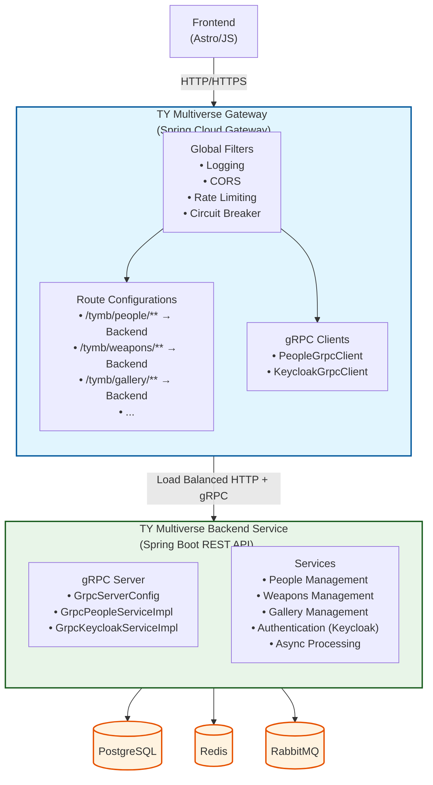

# TY Multiverse Gateway

  

> The unified API gateway and routing layer for the system, featuring rate limiting, circuit breaking, and centralized security.

## Table of Contents

- [Background](#background)
- [Install](#install)
- [Usage](#usage)
- [Architecture](#architecture)
- [Design Patterns](#design-patterns)
- [Deployment](#deployment)
- [Other](#other)

## Background

### 性能特性

#### 1. 反應式架構

基於 Spring WebFlux：
- 非阻塞 I/O
- 事件驅動
- 高併發處理能力

#### 2. 連接池管理

- HTTP 連接池
- Redis 連接池（可選）
- 自動連接重用

#### 3. 超時配置

```yaml
spring:
  cloud:
    gateway:
      httpclient:
        connect-timeout: 10000      # 連接超時
        response-timeout: 30s       # 響應超時
```

### 安全特性

#### 1. CORS 配置

限制允許的來源和方法：
```yaml
allowedOrigins:
  - https://your-frontend-domain.com
allowedMethods:
  - GET
  - POST
  - PUT
  - DELETE
```

#### 2. Rate Limiting

防止 DDoS 攻擊和濫用：
- 基於 IP 或用戶的限流
- 動態調整限流策略

#### 3. Circuit Breaker

保護後端服務：
- 防止級聯失敗
- 快速失敗機制
- 自動恢復

## Install

### 🔧 開發環境設定

#### 編譯指令

**重要：Gateway 項目包含 protobuf 代碼生成，編譯時必須使用正確的指令：**

```bash
## 完整編譯指令（推薦）
./mvnw clean generate-sources compile test-compile

## 或使用簡化指令
./mvnw clean compile test-compile

## 僅編譯主代碼
./mvnw clean generate-sources compile

## 僅編譯測試代碼
./mvnw clean compile test-compile
```

**編譯注意事項：**
- 必須使用 `generate-sources` 階段確保 protobuf 代碼正確生成
- 如果遇到 protobuf 類文件訪問錯誤，請使用完整的 `clean generate-sources compile test-compile` 指令
- 編譯包含 158 個源文件和 5 個 proto 文件

#### 依賴關係說明

**重要：必須按順序啟動服務**

1. **Backend 服務** - 提供實際業務功能
   ```bash
   cd ../ty-multiverse-backend
   mvn spring-boot:run
   ```

2. **Gateway** - API 網關入口
   ```bash
   mvn spring-boot:run
   ```

**服務連接：**
- Backend HTTP: `localhost:8080`
- Gateway API: `localhost:8082`

### 🚀 Gateway 服務啟動

#### 啟動指令
```bash
mvn spring-boot:run
```

#### 服務端點
- **API 入口**: `http://localhost:8082`
- **健康檢查**: `http://localhost:8082/actuator/health`
- **路由資訊**: `http://localhost:8082/actuator/gateway/routes`
- **API 文檔**: `http://localhost:8082/tymgateway/tymb/people/docs`

#### 測試指令
```bash
## 健康檢查
curl http://localhost:8082/actuator/health

## 測試人物 API
curl http://localhost:8082/tymgateway/tymb/people/get-all

## 查看路由配置
curl http://localhost:8082/actuator/gateway/routes
```

#### 前置條件
**必須先啟動 Backend 服務：**
```bash
cd ../ty-multiverse-backend
mvn spring-boot:run
```

## Usage

### 🧪 API 測試端點

#### 📋 架構說明

**Gateway API 處理模式：**
- **🟢 gRPC 控制器**：`/people/*`, `/weapons/*`, `/gallery/*`, `/deckofcards/*` - Gateway 內部處理，通過 gRPC 調用 Backend
- **🔄 路由轉發**：`/tymg/*` 路徑 - 通過 Spring Cloud Gateway 路由到 Backend
- **🔄 訊息佇列**：特定操作通過 RabbitMQ 到 Consumer 處理

**Consumer 整合說明：**
- 🔄 `/tymg/api/test/async/damage-calculation` - 觸發傷害計算模擬
- 🔄 `/tymg/api/test/async/people-get-all` - 觸發角色列表獲取模擬
- 🔄 `/tymg/api/request-status/*` - 查詢非同步處理結果

**這些端點會通過 RabbitMQ 發送訊息給 Consumer 服務進行非同步處理。**

#### 前置條件
**⚠️ 重要：測試前請確保 Backend 服務正在運行**
```bash
## 啟動 Backend 服務
cd ../ty-multiverse-backend
./mvnw spring-boot:run
```

#### 健康檢查
```bash
## Gateway 健康狀態
curl http://localhost:8082/actuator/health

## Backend 健康狀態（通過 Gateway 代理）
curl http://localhost:8082/tymg/actuator/health

## 查看所有路由配置
curl http://localhost:8082/actuator/gateway/routes
```

#### 👥 People 人物管理 API (CRUD 測試指令)

```bash
## 🟢 SELECT * - 獲取所有角色名稱 (Gateway 直接返回結果)
curl -X GET "http://localhost:8082/tymg/api/people/names" \
  -H "Content-Type: application/json" \
  -w "
HTTP Status: %{http_code}
" \
  -s
## ✅ Gateway 會在內部等待 Consumer 的結果並直接返回 200 + 真實資料，前端無需再 SSE/輪詢。

## 🟡 INSERT - 新增角色 (Gateway 同步代理)
curl -X POST "http://localhost:8082/tymg/api/people/insert" \
  -H "Content-Type: application/json" \
  -d '{
    "name": "TestUser",
    "age": 25,
    "level": 10,
    "attributes": "Test attributes"
  }' \
  -w "
HTTP Status: %{http_code}
" \
  -s

## 🔵 SELECT ALL - 獲取所有角色 (Gateway 同步代理)
curl -X POST "http://localhost:8082/tymg/api/people/get-all" \
  -H "Content-Type: application/json" \
  -w "
HTTP Status: %{http_code}
" \
  -s

## 🟠 SELECT by name - 根據名稱查詢角色 (Gateway 同步代理)
curl -X POST "http://localhost:8082/tymg/api/people/get-by-name" \
  -H "Content-Type: application/json" \
  -d '{"name": "Maya"}' \
  -w "
HTTP Status: %{http_code}
" \
  -s

## 🔴 DELETE ALL - 刪除所有角色 (Gateway 同步代理)
curl -X POST "http://localhost:8082/tymg/api/people/delete-all" \
  -H "Content-Type: application/json" \
  -w "
HTTP Status: %{http_code}
" \
  -s

## ⚔️ WEAPONS - 獲取所有武器 (Gateway 同步代理)
curl -X GET "http://localhost:8082/tymg/api/people/weapons" \
  -H "Content-Type: application/json" \
  -w "
HTTP Status: %{http_code}
" \
  -s

## 💥 DAMAGE - 計算傷害 (Gateway 同步代理)
curl -X GET "http://localhost:8082/tymg/api/people/damage?name=Maya" \
  -H "Content-Type: application/json" \
  -w "
HTTP Status: %{http_code}
" \
  -s

## ➕ INSERT MULTIPLE - 批量新增角色 (Gateway 同步代理)
curl -X POST "http://localhost:8082/tymg/api/people/insert-multiple" \
  -H "Content-Type: application/json" \
  -d '[
    {
      "name": "User1",
      "age": 20,
      "level": 5,
      "attributes": "Batch user 1"
    },
    {
      "name": "User2",
      "age": 22,
      "level": 7,
      "attributes": "Batch user 2"
    }
  ]' \
  -w "
HTTP Status: %{http_code}
" \
  -s
```bash
## 獲取所有武器
curl -X GET "http://localhost:8082/tymg/weapons/get-all"

## 根據名稱查詢武器
curl -X POST "http://localhost:8082/tymg/weapons/get-by-name" \
  -H "Content-Type: application/json" \
  -d '{"name": "測試武器"}'

## 計算傷害（武器 vs 防具）
curl -X POST "http://localhost:8082/tymg/weapons/calculate-damage" \
  -H "Content-Type: application/json" \
  -d '{
    "weaponName": "鐵劍",
    "armorName": "皮甲",
    "attackerLevel": 10,
    "defenderLevel": 8
  }'
```

#### 🖼️ Gallery 圖庫管理 API
```bash
## 獲取所有圖片
curl -X GET "http://localhost:8082/tymg/gallery/get-all"

## 根據ID查詢圖片
curl -X POST "http://localhost:8082/tymg/gallery/get-by-id" \
  -H "Content-Type: application/json" \
  -d '{"id": 1}'

## 上傳新圖片
curl -X POST "http://localhost:8082/tymg/gallery/save" \
  -H "Content-Type: application/json" \
  -d '{
    "title": "新圖片",
    "description": "圖片描述",
    "imageUrl": "https://example.com/image.jpg",
    "category": "人物"
  }'

## 更新圖片資訊
curl -X POST "http://localhost:8082/tymg/gallery/update" \
  -H "Content-Type: application/json" \
  -d '{
    "id": 1,
    "title": "更新後的標題",
    "description": "更新後的描述"
  }'

## 刪除圖片
curl -X POST "http://localhost:8082/tymg/gallery/delete" \
  -H "Content-Type: application/json" \
  -d '{"id": 1}'
```

#### 🃏 Deckofcards 撲克牌遊戲 API
```bash
## 開始新遊戲
curl -X POST "http://localhost:8082/tymg/deckofcards/start-game"

## 玩家要牌
curl -X POST "http://localhost:8082/tymg/deckofcards/player-hit"

## 玩家停牌
curl -X POST "http://localhost:8082/tymg/deckofcards/player-stand"

## 玩家加倍
curl -X POST "http://localhost:8082/tymg/deckofcards/player-double"

## 玩家分牌
curl -X POST "http://localhost:8082/tymg/deckofcards/player-split"

## 獲取遊戲狀態
curl -X POST "http://localhost:8082/tymg/deckofcards/get-game-status"
```

#### 🔐 認證與授權 API
```bash
## 獲取認證狀態
curl -X GET "http://localhost:8082/tymg/auth/status"

## 登入（如果啟用）
curl -X POST "http://localhost:8082/tymg/auth/login" \
  -H "Content-Type: application/json" \
  -d '{
    "username": "admin",
    "password": "password"
  }'

## 檢查權限
curl -X GET "http://localhost:8082/tymg/auth/permissions"
```

#### 📊 監控與指標 API
```bash
## 應用健康狀態
curl http://localhost:8082/actuator/health

## 應用指標
curl http://localhost:8082/actuator/metrics

## 記憶體使用情況
curl http://localhost:8082/actuator/metrics/jvm.memory.used

## HTTP 請求統計
curl http://localhost:8082/actuator/metrics/http.server.requests

## Prometheus 格式指標
curl http://localhost:8082/actuator/prometheus
```

#### 🧪 非同步測試 API (會走到 Consumer)
```bash
## 🔄 檢查非同步請求狀態
curl "http://localhost:8082/tymg/api/request-status?requestId=your-request-id"

## 🔄 觸發傷害計算模擬 (發送到 Consumer)
curl -X POST "http://localhost:8082/tymg/api/test/async/damage-calculation" \
  -H "Content-Type: application/json" \
  -d '{"requestId": "uuid-123", "characterName": "Maya"}'

## 🔄 觸發角色列表獲取模擬 (發送到 Consumer)
curl -X POST "http://localhost:8082/tymg/api/test/async/people-get-all" \
  -H "Content-Type: application/json" \
  -d '{"requestId": "uuid-456"}'

## 🔄 生成測試 UUID
curl "http://localhost:8082/tymg/api/test/async/generate-uuid"
```

#### 📚 文檔與資訊 API
```bash
## JavaDoc 文檔
curl http://localhost:8082/tymg/docs/

## Swagger UI
curl http://localhost:8082/tymg/swagger-ui/

## API 規範
curl http://localhost:8082/tymg/v3/api-docs
```

#### 💡 測試提示
- **所有 POST/PUT/DELETE 請求都需要正確的 JSON 格式**
- **確保 Backend 服務運行在 `http://localhost:8080`**
- **測試 Consumer 端點時，需啟動 Consumer 服務：**
  ```bash
  cd ../ty-multiverse-consumer
  ./mvnw spring-boot:run
  ```
- **🏗️ 架構原則：Gateway 絕對不能直接連接數據庫！**
  - Gateway 只負責路由和協調，不處理業務邏輯
  - 所有數據操作都通過 gRPC 調用 Backend 或 Consumer 處理
- **檢查網路連接和防火牆設定**
- **查看 Gateway 日誌以獲取詳細錯誤資訊**
- **使用 `-v` 參數獲取詳細的 HTTP 請求響應資訊**
- **Consumer 處理是非同步的，可能需要等待幾秒鐘才能看到結果**

### 故障排查指南

#### 1. 連接問題

檢查：
- Backend 服務是否運行
- 網絡連接是否正常
- 防火牆規則

#### 2. 性能問題

分析：
- 響應時間過長的端點
- CPU 和記憶體使用情況
- 後端服務性能

#### 3. 錯誤追蹤

使用：
- 日誌關聯 ID（Trace ID）
- 錯誤堆疊跟蹤
- 監控指標分析

### 故障排查

#### 常見問題

1. **無法連接到 Backend**
   - 檢查 `PUBLIC_TYMB_URL` 配置
   - 確認 Backend 服務正常運行
   - 查看網絡連接和防火牆設置

2. **CORS 錯誤**
   - 檢查 `PUBLIC_FRONTEND_URL` 配置
   - 確認 CORS 配置正確

3. **限流不生效**
   - 確認 Redis 服務正常運行
   - 檢查 Redis 連接配置

## Architecture

### 系統架構圖

#### gRPC 三層架構

```mermaid
flowchart TD
    subgraph Backend_App [Backend (ty-multiverse-backend)]
        direction TB
        
        subgraph GrpcServerGroup [GrpcServerConfig]
            direction TB
            A1[啟動 gRPC Server<br/>端口 50051]
            A2[註冊 PeopleService]
            A3[註冊 KeycloakService]
        end
        
        subgraph GrpcPeopleServiceGroup [GrpcPeopleServiceImpl]
            direction TB
            B1[getAllPeople]
            B2[getPeopleByName]
            B3[insertPeople]
        end
        
        subgraph GrpcKeycloakServiceGroup [GrpcKeycloakServiceImpl]
            direction TB
            C1[processAuthRedirect]
            C2[logout]
            C3[introspectToken]
        end
    end

    subgraph Gateway_App [Gateway (ty-multiverse-gateway)]
        direction TB
        
        subgraph PeopleGrpcClientGroup [PeopleGrpcClient]
            direction TB
            D1[getAllPeople]
            D2[getPeopleByName]
            D3[insertPeople]
        end
        
        subgraph KeycloakGrpcClientGroup [KeycloakGrpcClient]
            direction TB
            E1[processAuthRedirect]
            E2[logout]
            E3[introspectToken]
        end
        
        subgraph HttpControllersGroup [HTTP Controllers]
            direction TB
            F1[PeopleController]
            F2[KeycloakController]
        end
    end

    Gateway_App -- "gRPC 調用" --> Backend_App
    
    classDef bg fill:#f9f9f9,stroke:#333,stroke-width:2px;
    class Backend_App,Gateway_App bg;
```

#### 完整系統架構


```mermaid
graph TD
    Frontend["Frontend<br/>(Astro/JS)"]

    subgraph Gateway ["TY Multiverse Gateway<br/>(Spring Cloud Gateway)"]
        direction TB
        GlobalFilters["Global Filters<br/>• Logging<br/>• CORS<br/>• Rate Limiting<br/>• Circuit Breaker"]
        Routes["Route Configurations<br/>• /tymb/people/** → Backend<br/>• /tymb/weapons/** → Backend<br/>• /tymb/gallery/** → Backend<br/>• ..."]
        GrpcClients["gRPC Clients<br/>• PeopleGrpcClient<br/>• KeycloakGrpcClient"]
        
        GlobalFilters --> Routes
        GlobalFilters --> GrpcClients
    end

    subgraph Backend ["TY Multiverse Backend Service<br/>(Spring Boot REST API)"]
        direction TB
        GrpcServer["gRPC Server<br/>• GrpcServerConfig<br/>• GrpcPeopleServiceImpl<br/>• GrpcKeycloakServiceImpl"]
        Services["Services<br/>• People Management<br/>• Weapons Management<br/>• Gallery Management<br/>• Authentication (Keycloak)<br/>• Async Processing"]
    end

    PGDB[(PostgreSQL)]
    RedisDB[(Redis)]
    RabbitMQ[(RabbitMQ)]

    Frontend -- "HTTP/HTTPS" --> Gateway
    Gateway -- "Load Balanced HTTP + gRPC" --> Backend
    Backend --> PGDB
    Backend --> RedisDB
    Backend --> RabbitMQ

    classDef web fill:#e1f5fe,stroke:#01579b,stroke-width:2px;
    classDef api fill:#e8f5e8,stroke:#1b5e20,stroke-width:2px;
    classDef db fill:#fff3e0,stroke:#e65100,stroke-width:2px;

    class Gateway web;
    class Backend api;
    class PGDB,RedisDB,RabbitMQ db;
```

### 技術架構

- **Spring Boot**: 3.2.7
- **Spring Cloud Gateway**: 2023.0.2
- **Java**: 21
- **Redis**: 用於分散式限流
- **Resilience4j**: 熔斷器實現

### 核心組件

#### 1. Route Predicates（路由斷言）

路由斷言定義了哪些請求應該被路由到哪個服務。

```yaml
routes:
  - id: people-route
    uri: http://backend:8080
    predicates:
      - Path=/tymb/people/**
```

#### 2. Gateway Filters（網關過濾器）

##### 2.1 CircuitBreaker（熔斷器）

使用 Resilience4j 實現：
- 監控後端服務健康狀況
- 當失敗率超過閾值時自動熔斷
- 提供降級響應

```yaml
filters:
  - name: CircuitBreaker
    args:
      name: backendCircuitBreaker
      fallbackUri: forward:/fallback
```

##### 2.2 RequestRateLimiter（限流器）

基於 Redis 的分散式限流：
- 令牌桶算法
- 支援分散式部署
- 可配置補充速率和容量

#### 3. Global Filters（全局過濾器）

##### 3.1 LoggingGlobalFilter

記錄所有請求和響應：
- 請求方法和路徑
- 來源 IP
- 響應狀態碼
- 處理時間

##### 3.2 CORS Filter

統一處理跨域請求：
- 允許特定來源
- 配置允許的方法和標頭
- 支援憑證傳遞

#### 4. Fallback Controller（降級控制器）

當後端服務不可用時提供降級響應：
- 返回標準錯誤格式
- 503 Service Unavailable
- 包含時間戳和錯誤信息

### 請求流程

1. 客戶端發送請求
   ↓
2. Gateway 接收請求
   ↓
3. LoggingGlobalFilter 記錄請求
   ↓
4. CORS Filter 處理跨域
   ↓
5. RequestRateLimiter 檢查限流
   ↓
6. 路由匹配（Route Predicates）
   ↓
7. CircuitBreaker 檢查後端健康狀態
   ↓
8. 轉發請求到 Backend
   ↓
9. Backend 處理並返回響應
   ↓
10. Gateway 返回響應給客戶端
    ↓
11. LoggingGlobalFilter 記錄響應

## Design Patterns

### 🎯 設計模式 (Design Patterns)

本專案作為微服務叢集的單一入口閘道，應用了以下高併發與路由設計模式：

- **API 閘道 / 外觀模式 (API Gateway / Facade)**: 將多個微服務 (Backend, Consumer 等) 的複雜呼叫收斂於單一入口點，提供統一介面。
- **過濾器模式 (Filter Pattern)**: 利用 Spring Cloud Gateway 的 Global Filter 攔截並修改 HTTP 請求與響應 (解決 CORS, Logging, Route Predicates 等)。
- **熔斷器模式 (Circuit Breaker)**: 引入 Resilience4j 防止後端雪崩效應，實作自動狀態切換及降級機制來保護系統可用性。

## Deployment

### 📊 監控與狀態檢查

#### 監控端點
```bash
## Gateway 健康檢查
curl http://localhost:8082/actuator/health

## 路由配置檢查
curl http://localhost:8082/actuator/gateway/routes

## 性能指標
curl http://localhost:8082/actuator/metrics
```

#### 啟動日誌確認
啟動時會看到 Gateway 服務正常啟動的日誌訊息。

### 監控與可觀測性

#### 1. Actuator 端點

- `/actuator/health` - 健康檢查
- `/actuator/metrics` - 指標數據
- `/actuator/prometheus` - Prometheus 格式指標
- `/actuator/gateway/routes` - 路由信息

#### 2. 監控指標

- HTTP 請求統計
- 路由響應時間
- 熔斷器狀態
- 限流統計

#### 3. 日誌記錄系統

##### 3.1 統一請求響應日誌記錄（AOP）

本專案使用統一的請求響應日誌記錄系統，自動記錄所有 Controller 方法的請求和響應：

**日誌輸出範例：**
```
🚀 [abc12345] GET /tymgateway/tymb/people/get-all - Started
📝 [abc12345] Request parameters: []
📋 [abc12345] Request headers: User-Agent: Mozilla/5.0..., Content-Type: application/json
✅ [abc12345] GET /tymgateway/tymb/people/get-all - Completed in 150ms
📤 [abc12345] Response: {"success":true,"message":"People retrieved successfully via gRPC","people":[...],"count":153}
```

**功能特點：**
- **自動化記錄**：無需在每個 Controller 中手動添加日誌程式碼
- **請求追蹤**：每個請求都有唯一 ID，方便問題追蹤
- **效能監控**：自動記錄響應時間，幫助發現效能問題
- **安全性**：自動過濾敏感資訊，避免洩露機密資料
- **可配置**：通過日誌級別控制記錄詳情程度

##### 3.2 現有日誌過濾器

所有請求和響應也會被現有的 `LoggingGlobalFilter` 記錄：
```
2024-10-02 15:51:02 Gateway Request: GET /tymb/weapons from /192.168.1.100
2024-10-02 15:51:02 Gateway Response: GET /tymb/weapons - Status: 200 - Duration: 45ms
```

**兩種日誌記錄的區別：**
- **AOP 日誌**：結構化記錄每個 Controller 方法的詳細請求響應資訊
- **Filter 日誌**：記錄網路層級的請求響應資訊，適用於所有路由

### Docker 部署

#### 構建鏡像

```bash
docker build -t ty-multiverse-gateway:latest .
```

#### 運行容器

```bash
docker run -p 8081:8081 \
  -e PUBLIC_TYMB_URL=http://backend:8080 \
  -e PUBLIC_FRONTEND_URL=http://your-frontend-url \
  ty-multiverse-gateway:latest
```

### Kubernetes 部署

#### 部署到 K8s

```bash
cd k8s
kubectl apply -f deployment.yaml -n ty-multiverse
```

#### 查看部署狀態

```bash
kubectl get pods -n ty-multiverse -l app=ty-multiverse-gateway
kubectl logs -f -n ty-multiverse -l app=ty-multiverse-gateway
```

#### 檢查服務

```bash
kubectl get svc -n ty-multiverse ty-multiverse-gateway-service
```

### 監控與維護

#### 健康檢查

```bash
curl http://localhost:8081/actuator/health
```

#### 查看路由信息

```bash
curl http://localhost:8081/actuator/gateway/routes
```

#### Prometheus 指標

```bash
curl http://localhost:8081/actuator/prometheus
```

### 性能調優

#### JVM 參數配置

在 Dockerfile 中已配置：
- `-Xms256m -Xmx512m`: 堆內存大小
- `-XX:+UseG1GC`: 使用 G1 垃圾收集器
- `-XX:MaxGCPauseMillis=200`: GC 暫停時間目標

#### 限流配置

在 `application.yml` 中調整：
```yaml
redis-rate-limiter.replenishRate: 100  # 每秒補充令牌數
redis-rate-limiter.burstCapacity: 200  # 令牌桶容量
```

#### 熔斷器配置

在 `application.yml` 中調整：
```yaml
resilience4j:
  circuitbreaker:
    configs:
      default:
        slidingWindowSize: 100          # 滑動窗口大小
        failureRateThreshold: 50        # 失敗率閾值
        waitDurationInOpenState: 10s    # 熔斷器打開持續時間
```

### 授權

Copyright © 2024 TY Team

## Other

### 🎯 Gateway 角色定位

Gateway 作為系統的**統一入口閘道**，專注於以下職責：

- **🔐 統一認證授權**：處理 JWT 驗證和權限檢查
- **🚦 流量控制**：實現限流、熔斷和負載均衡
- **📊 統一監控**：記錄所有請求響應和性能指標
- **🔄 協議轉換**：將 HTTP 請求轉換為 gRPC 調用
- **🛡️ 安全防護**：CORS、請求驗證和異常處理

### 🚀 快速開始

#### 環境準備
1. **啟動 Backend 服務**（必須）
   ```bash
   cd ../ty-multiverse-backend
   mvn spring-boot:run
   ```

2. **啟動 Gateway**
   ```bash
   mvn spring-boot:run
   ```

#### 服務端點
- **Gateway API**: `http://localhost:8082`
- **健康檢查**: `http://localhost:8082/actuator/health`
- **API 文檔**: `http://localhost:8082/tymgateway/tymb/people/docs`

### 🎯 Gateway 核心功能

TY Multiverse Gateway 作為微服務架構中的 API 網關，提供：

- **🔐 統一認證授權**：JWT 驗證和權限檢查
- **🚦 流量控制**：限流、熔斷和負載均衡
- **📊 統一監控**：請求響應記錄和性能指標
- **🔄 協議轉換**：HTTP 請求轉換為 gRPC 調用
- **🛡️ 安全防護**：CORS、請求驗證和異常處理

### 擴展性

#### 1. 水平擴展

Gateway 無狀態設計，支援水平擴展：
```yaml
replicas: 2  # K8s 中可輕鬆擴展
```

#### 2. 負載均衡

支援多後端實例：
- Round Robin
- Weighted Response Time
- Random

#### 3. 動態路由

可在運行時添加或修改路由配置。

### 容錯機制

#### 1. 重試策略

對失敗的請求自動重試：
```yaml
filters:
  - name: Retry
    args:
      retries: 3
      statuses: BAD_GATEWAY
```

#### 2. 超時處理

設置合理的超時時間防止請求堆積。

#### 3. 降級響應

當後端不可用時提供友好的錯誤信息。

### 路由配置

Gateway 轉發以下端點到 Backend：

| 路徑 | 目標服務 | 說明 |
|------|---------|------|
| `/tymb/people/**` | Backend | 人物管理 API |
| `/tymb/people-images/**` | Backend | 人物圖片 API |
| `/tymb/weapons/**` | Backend | 武器管理 API |
| `/tymb/gallery/**` | Backend | 圖庫管理 API |
| `/tymb/ckeditor/**` | Backend | CKEditor 文件上傳 |
| `/tymb/deckofcards/blackjack/**` | Backend | 21點遊戲 API |
| `/tymb/auth/**` | Backend | 認證 API |
| `/tymb/keycloak/**` | Backend | Keycloak 整合 |
| `/tymb/api/request-status/**` | Backend | 異步請求狀態 |
| `/tymb/api/test/async/**` | Backend | 異步測試 API |
| `/tymb/docs/**` | Backend | JavaDoc 文檔 |
| `/tymb/actuator/**` | Backend | Actuator 監控 |
| `/tymb/swagger-ui/**` | Backend | Swagger UI |

### 項目結構

```
ty-multiverse-gateway/
├── src/
│   ├── main/
│   │   ├── java/
│   │   │   └── tw/com/tymgateway/
│   │   │       ├── TYMGatewayApplication.java     # 主應用類
│   │   │       ├── config/
│   │   │       │   └── GatewayConfig.java         # Gateway 配置
│   │   │       ├── controller/
│   │   │       │   └── FallbackController.java    # 熔斷降級控制器
│   │   │       └── filter/
│   │   │           └── LoggingGlobalFilter.java   # 全局日誌過濾器
│   │   └── resources/
│   │       ├── application.yml                     # 主配置文件
│   │       ├── application-local.yml              # 本地環境配置
│   │       └── env/
│   │           ├── local.properties               # 本地環境變數
│   │           └── platform.properties            # 平台環境變數
│   └── test/                                      # 測試代碼
├── k8s/
│   └── deployment.yaml                            # K8s 部署配置
├── Dockerfile                                      # Docker 鏡像構建
├── Jenkinsfile                                     # CI/CD 流程
├── pom.xml                                         # Maven 配置
└── README.md                                       # 本文檔
```

### 本地開發

#### 前置要求

- Java 21
- Maven 3.9+
- Redis (可選，用於限流功能)

#### 啟動步驟

1. **啟動 Backend 服務**
   ```bash
   cd ../ty-multiverse-backend
   mvn spring-boot:run
   ```

2. **啟動 Gateway**
   ```bash
   mvn clean compile -Dmaven.test.skip=true spring-boot:run
   ```

   Gateway 將在 `http://localhost:8081` 啟動

3. **訪問測試**
   ```bash
   # 測試健康檢查
   curl http://localhost:8081/actuator/health
   
   # 測試路由轉發（需要 Backend 運行）
   curl http://localhost:8081/tymb/weapons
   ```

#### 配置說明

本地開發時，請複製範例配置文件：

```bash
## 複製範例配置文件
cp src/main/resources/env/local.properties.example src/main/resources/env/local.properties
```

然後在 `src/main/resources/env/local.properties` 中修改配置：

```properties
## Backend 服務地址
PUBLIC_TYMB_URL=http://localhost:8080

## 前端地址（CORS）
PUBLIC_FRONTEND_URL=http://localhost:4321

## Redis 配置（可選）
REDIS_HOST=localhost
REDIS_CUSTOM_PORT=6379
REDIS_PASSWORD=
```
