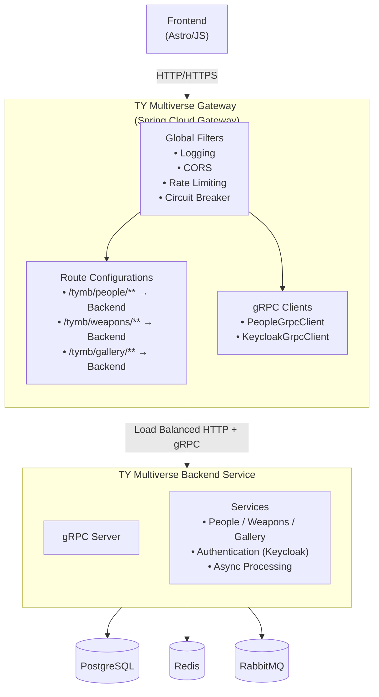

# TY Multiverse Gateway

  

> The unified API gateway and routing layer for the system, featuring rate limiting, circuit breaking, and centralized security.

## Table of Contents

- [Background](#background)
- [Architecture](#architecture)
- [Design Patterns](#design-patterns)
- [Other](#other)

## Background

### 性能特性

- **反應式架構**：基於 Spring WebFlux，非阻塞 I/O，事件驅動，高併發處理
- **連接池管理**：HTTP + Redis 連接池，自動連接重用
- **超時配置**：connect-timeout 10s，response-timeout 30s

### 安全特性

- **CORS 配置**：限制允許的來源和方法
- **Rate Limiting**：基於 IP 或用戶的分散式限流（Redis 令牌桶）
- **Circuit Breaker**：Resilience4j 熔斷，防止級聯失敗

### 路由配置

| 路徑 | 目標服務 | 說明 |
|------|---------|------|
| `/tymb/people/**` | Backend | 人物管理 API |
| `/tymb/weapons/**` | Backend | 武器管理 API |
| `/tymb/gallery/**` | Backend | 圖庫管理 API |
| `/tymb/deckofcards/blackjack/**` | Backend | 21點遊戲 API |
| `/tymb/auth/**` | Backend | 認證 API |
| `/tymb/keycloak/**` | Backend | Keycloak 整合 |
| `/tymb/api/request-status/**` | Backend | 異步請求狀態 |
| `/tymb/swagger-ui/**` | Backend | Swagger UI |

## Architecture

### gRPC 三層架構

```mermaid
flowchart TD
    subgraph Backend_App [Backend (ty-multiverse-backend)]
        direction TB
        subgraph GrpcServerGroup [GrpcServerConfig]
            A1[啟動 gRPC Server<br/>端口 50051]
            A2[註冊 PeopleService]
            A3[註冊 KeycloakService]
        end
        subgraph GrpcPeopleServiceGroup [GrpcPeopleServiceImpl]
            B1[getAllPeople]
            B2[getPeopleByName]
            B3[insertPeople]
        end
    end

    subgraph Gateway_App [Gateway (ty-multiverse-gateway)]
        direction TB
        subgraph PeopleGrpcClientGroup [PeopleGrpcClient]
            D1[getAllPeople]
            D2[getPeopleByName]
            D3[insertPeople]
        end
        subgraph HttpControllersGroup [HTTP Controllers]
            F1[PeopleController]
            F2[KeycloakController]
        end
    end

    Gateway_App -- "gRPC 調用" --> Backend_App
```

### 完整系統架構


```mermaid
graph TD
    Frontend["Frontend<br/>(Astro/JS)"]

    subgraph Gateway ["TY Multiverse Gateway<br/>(Spring Cloud Gateway)"]
        direction TB
        GlobalFilters["Global Filters<br/>• Logging<br/>• CORS<br/>• Rate Limiting<br/>• Circuit Breaker"]
        Routes["Route Configurations<br/>• /tymb/people/** → Backend<br/>• /tymb/weapons/** → Backend<br/>• /tymb/gallery/** → Backend"]
        GrpcClients["gRPC Clients<br/>• PeopleGrpcClient<br/>• KeycloakGrpcClient"]
        GlobalFilters --> Routes
        GlobalFilters --> GrpcClients
    end

    subgraph Backend ["TY Multiverse Backend Service"]
        direction TB
        GrpcServer["gRPC Server"]
        Services["Services<br/>• People / Weapons / Gallery<br/>• Authentication (Keycloak)<br/>• Async Processing"]
    end

    PGDB[(PostgreSQL)]
    RedisDB[(Redis)]
    RabbitMQ[(RabbitMQ)]

    Frontend -- "HTTP/HTTPS" --> Gateway
    Gateway -- "Load Balanced HTTP + gRPC" --> Backend
    Backend --> PGDB
    Backend --> RedisDB
    Backend --> RabbitMQ
```

### 請求流程

```
客戶端請求 → Gateway → LoggingGlobalFilter → CORS Filter → RequestRateLimiter
→ 路由匹配 → CircuitBreaker → 轉發到 Backend → 返回響應
```

## Design Patterns

### 🎯 設計模式 (Design Patterns)

- **API 閘道 / 外觀模式 (API Gateway / Facade)**: 將多個微服務呼叫收斂於單一入口點，提供統一介面。
- **過濾器模式 (Filter Pattern)**: 利用 Spring Cloud Gateway 的 Global Filter 攔截並修改 HTTP 請求與響應。
- **熔斷器模式 (Circuit Breaker)**: 引入 Resilience4j 防止後端雪崩效應，實作自動狀態切換及降級機制。

## Other

### 服務端點

- **Gateway API**: `http://localhost:8082`
- **健康檢查**: `http://localhost:8082/actuator/health`
- **路由資訊**: `http://localhost:8082/actuator/gateway/routes`

### 技術棧

- Spring Boot 3.2.7 / Spring Cloud Gateway 2023.0.2 / Java 21
- Redis（分散式限流）/ Resilience4j（熔斷器）

> 啟動指令、API 測試 curl 範例、Docker/K8s 部署、性能調優請見 [AGENTS.md](AGENTS.md)。
